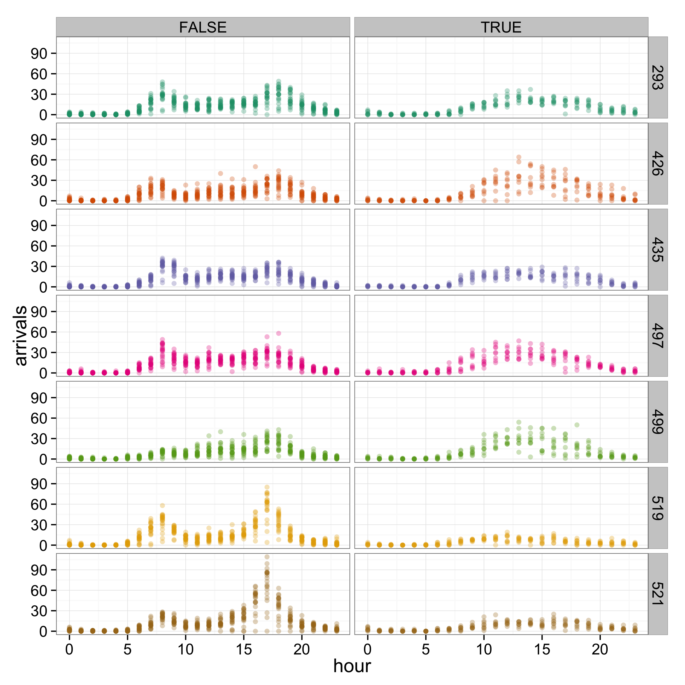
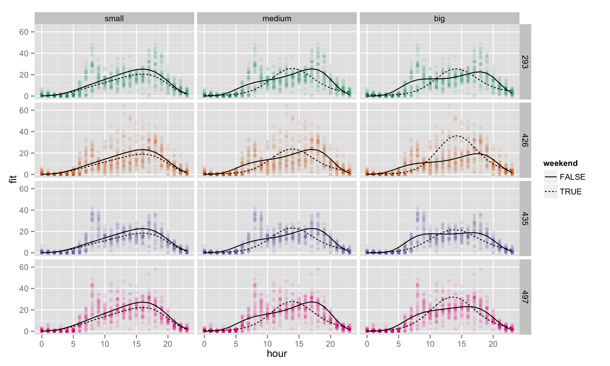
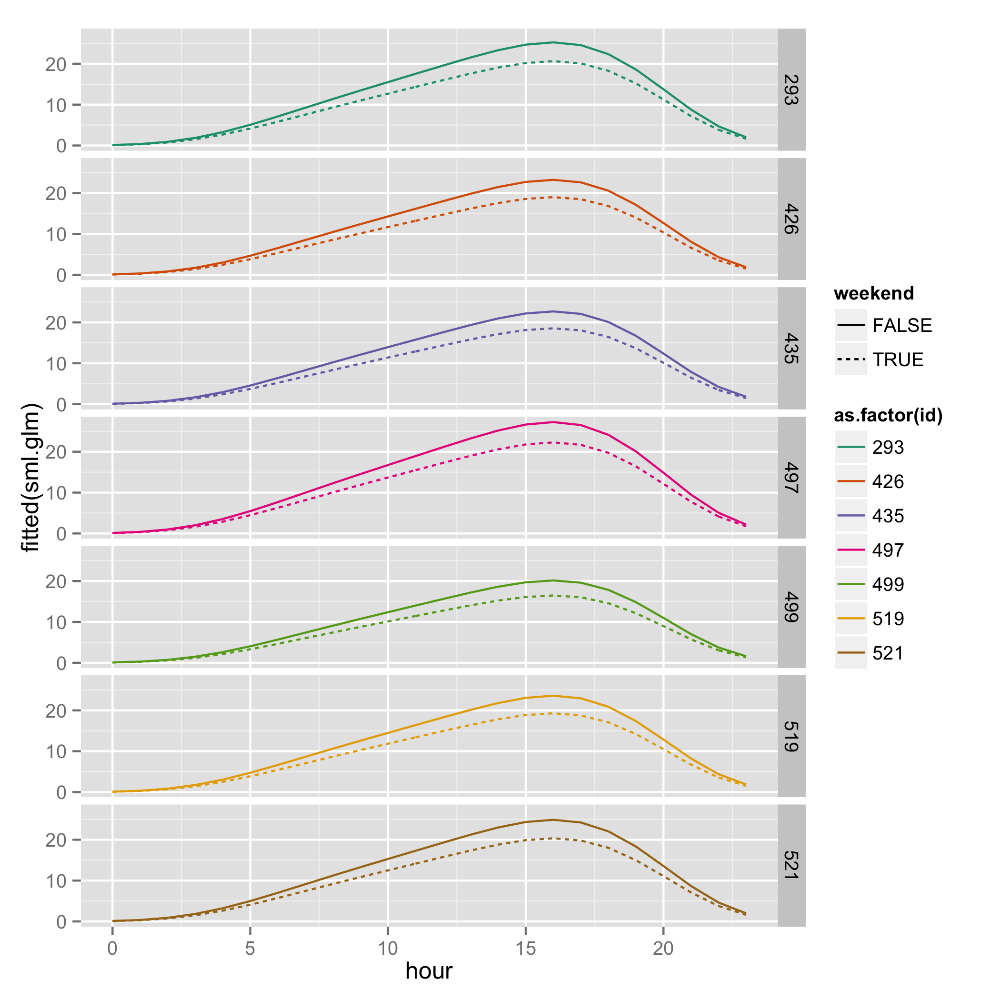
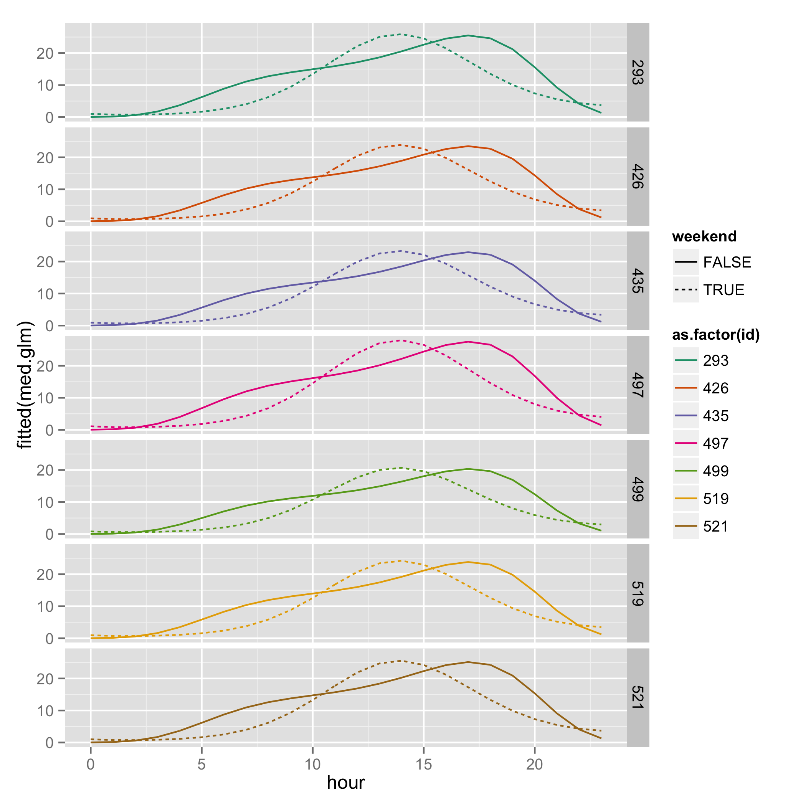
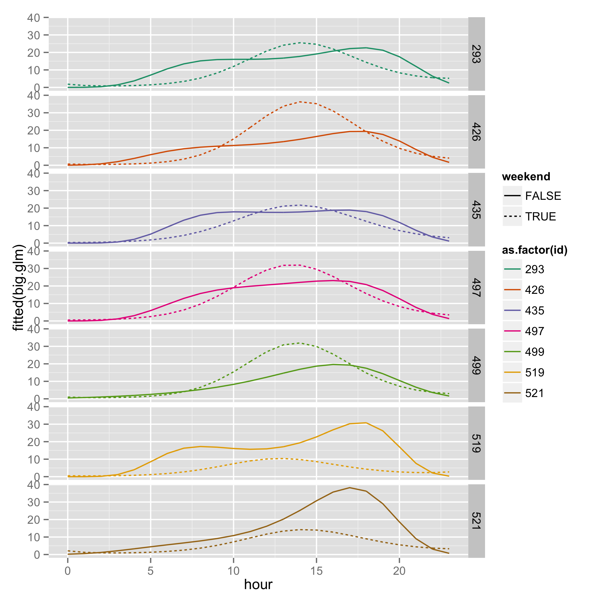

<!--
# THOUGHTS and TODO: 
- need something more compelling for `iterators`
- more complicated example for `.combine`? mean?
- images for heavy analysis?
- references
-->


<!--
<span class='one'>class one</span>
<span class='two'>class two</span>
<span class='three'>class three</span>
<span class='four'>class four</span>
<span class='five'>class five</span>
<span class='six'>class six</span>
<span class='seven'>class seven</span>
<span class='eight'>class eight</span>
<span class='nine'>class nine</span>
<span class='ten'>class ten</span>
<span class='eleven'>class eleven</span>
<span class='twelve'>class twelve</span>
-->

# why?
## embarassingly parallel tasks
These are computational tasks which involve many separate, independently executable calculations. Some common statistical examples of embarassingly <span class = 'eleven'>**parallel**</span> processes: 

- bootstrapping
- cross-validation 
- simulating independent random variables (`dorng`)

In contrast, some sequential or <span class = 'eleven'>**non-parallel**</span> processes:

- MCMC algorithms 
- several types of model selection (e.g.: `step()` or the LARS algorithm for LASSO)

`for` loops that do not explicitly involve dependent calculations are wasteful if we have multiple processors available. Perhaps even worse, the time cost of using such an approach can put some useful statistical tools beyond our reach!

## options
- Changing from a for loop to one of the `apply()` functions can help, but still doesn't use multiple processors.
- Use the `parallel` package.
- Don't use R.
- Use the `snowfall` package! [@snowfall]


## why snowfall?
We would like to find a way to make use of our whole computer, and make valuable tasks like bootstrapping available, but without having to invest large amounts of time in learning new programming languages. Enter `snowfall`, which keeps the structure of a for loop, but allows us to drop two key assumptions: 

- sequentiality
- single processor architecture

<span class = 'ten'>**Our goal**</span>: 
We will begin with a simple chunk of R code involving a for loop and transform it into a `snowfall` loop. Along the way, we'll take a look at the equivalent computation done with an `apply()` function, and see that using `snowfall` and multiple processors outperforms this.

# example: data and research question
We are going to look at data from the New York City bikeshare program [Citibike](https://www.citibikenyc.com/). 

- 7 busiest locations from May 2014
- response: # of arrivals each hour of every day in the month
- covariates: hour of the day and whether the day is a weekend

One of the costliest parts of operating a bike share program comes from the finiteness of the bicycle stations. A station can only hold so many bicycles, and a full (empty) station means customers cannot drop off (pick up) a bike. Thus, managers are forced to use trucks to manually redistribute bicycles.

We want to find a model which can offer good prediction, with the hope that this will inform our plans for future station locations/sizes. For this example, we start with a few plausible models and use K-fold cross validation to decide which one to use.

## locations of our 7 sites


****
## data


****
# fitting GLMs and extracting prediction error
We are considering three increasingly complex models of the arrival behavior. In order to compare three candidate models' prediction error, we'll use K-fold cross validation, where we use the same folds for all three models. 

First, we the load the data and make our K-fold test sets (and implicitly, our training sets):

```r
load(url("http://www.stat.colostate.edu/~scharfh/CSP_parallel/data/arrivals_subset.RData"))
K <- 50
N <- dim(arrivals.sub)[1]

## for convenience kill off 8 observations (we have 5208) and make cv test sets
set.seed(1985)
discarded <- sample(1:N, size = 8)
cv.test.sets <- matrix(sample((1:N)[-discarded], size = N - 8), ncol = K)
```

Next, we build a function to fit the data to the training sets and extract the corresponding estimate of prediciton error. This should still be familiar code, no new packages yet.

```r
library(splines)
lq.loss <- function(y, y.hat, q = 1) {(abs(y - y.hat))^q}
get.errs <- function(test.set = NULL,
                     discarded = NULL,
                     q = 1) {
    sml.glm <- glm(arrivals ~
                   bs(hour, degree = 4)
                   + weekend
                   + as.factor(id),
                   data = arrivals.sub[-c(discarded, test.set), ],
                   family = "poisson")
    med.glm <- glm(arrivals ~
                   bs(hour, degree = 4)*weekend
                   + as.factor(id),
                   data = arrivals.sub[-c(discarded, test.set), ],
                   family = "poisson")
    big.glm <- glm(arrivals ~
                   bs(hour, degree = 4)*weekend
                   + bs(hour, degree = 4)*as.factor(id),
                   data = arrivals.sub[-c(discarded, test.set), ],
                   family = "poisson")
    sml.err <- mean(lq.loss(predict(object = sml.glm,
                                    newdata = arrivals.sub[test.set, -7],
                                    type = "response"),
                            arrivals.sub[test.set, 7],
                            q = q))
    med.err <- mean(lq.loss(predict(object = med.glm,
                                    newdata = arrivals.sub[test.set, -7],
                                    type = "response"),
                            arrivals.sub[test.set, 7],
                            q = q))
    big.err <- mean(lq.loss(predict(object = big.glm,
                                    newdata = arrivals.sub[test.set, -7],
                                    type = "response"),
                            arrivals.sub[test.set, 7],
                            q = q))
    return(c(sml.err, med.err, big.err))
}
```

The fits using all the data look like:



<!--



-->

## K-fold CV with a for loop
Using a naive for loop, we could implement this as:

```r
err.for <- NULL
system.time(
    for (i in 1:K) {
        err.for <- cbind(err.for, get.errs(test.set = cv.test.sets[, i],
                                           discarded = discarded,
                                           q = 1))
        }
    )
```

```
##    user  system elapsed 
##  20.243   1.309  21.560
```


## K-fold CV with an apply function
If you're good with `apply()` functions you might upgrade (slightly) to

```r
## apply version
system.time(
    err.apply <- sapply(X = 1:K, 
                        FUN = function(i) {
                            get.errs(test.set = cv.test.sets[, i],
                                     discarded = discarded,
                                     q = 1)
                            }
                        )
    )
```

```
##    user  system elapsed 
##  20.189   1.349  21.564
```

Neither of the first two methods take advantage of multiple processors. While the `apply()` functions avoid the inherently sluggish nature of for loops in `R`, they are still ignorant of the processor structure. We want to chop the job into halves, fourths, etc. and use the _whole_ computer!


## K-fold CV with a snowfall loop
Here is the same computation written with a `snowfall` loop


```r
## Define a wrapper function
wrapper = function(i){
  get.errs(test.set = cv.test.sets[, i], discarded = discarded, q = 1)
}

## snowfall version
library(snowfall)
library(parallel)
library(rlecuyer)
# ## determines the number of cores on the machine
cps=detectCores()
## Initalize multicore 
sfInit(parallel=TRUE, cpus=cps)
## Setup random number generator on the cluster
sfClusterSetupRNG()
# export global variables
sfExportAll()
# export library
sfLibrary(splines)
system.time(err.snowfall <- sfSapply(1:K, wrapper))
## ends snowfall session
sfStop()
```
# components of a snowfall loop
Note that the syntax of snowfall is almost identical to a for loop. The major difference is the need to write a wrapper function that evaluates one iteration of the for loop and the need to set up and export the relevent data, functions, and libraries.

# results


[snowfall](http://CRAN.R-project.org/package=snowfall)

## Other tutorials

## Data 
[citibike system data](https://www.citibikenyc.com/system-data)
